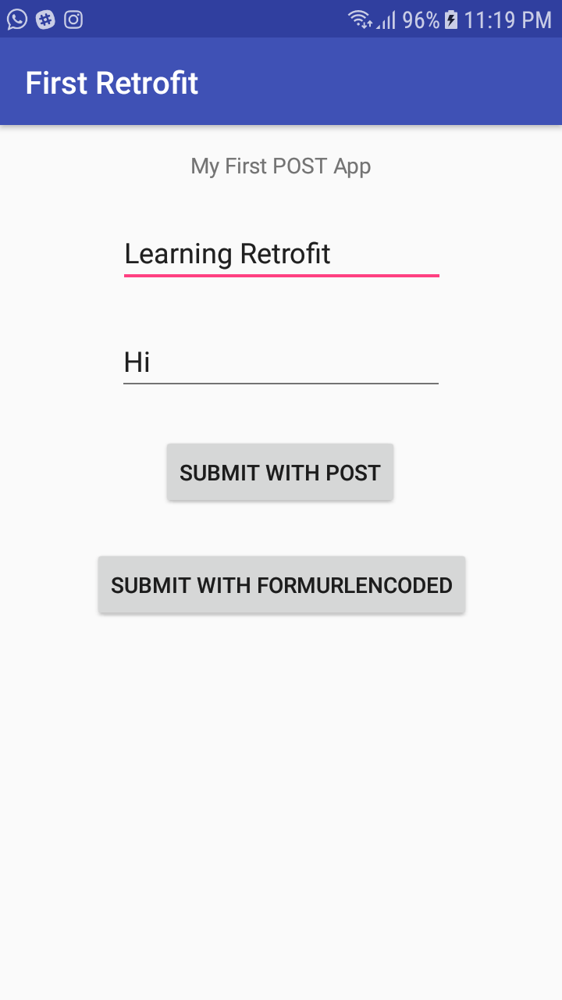
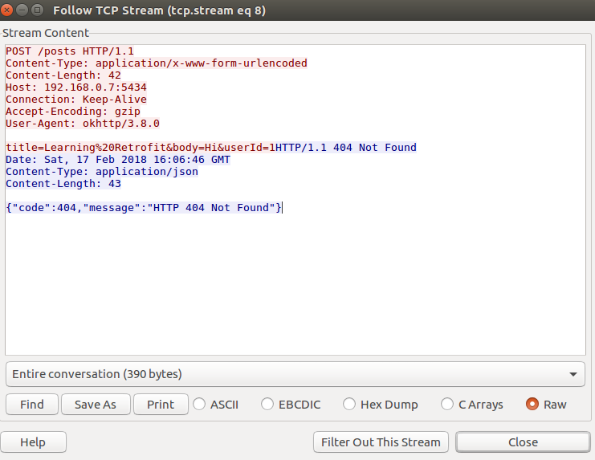
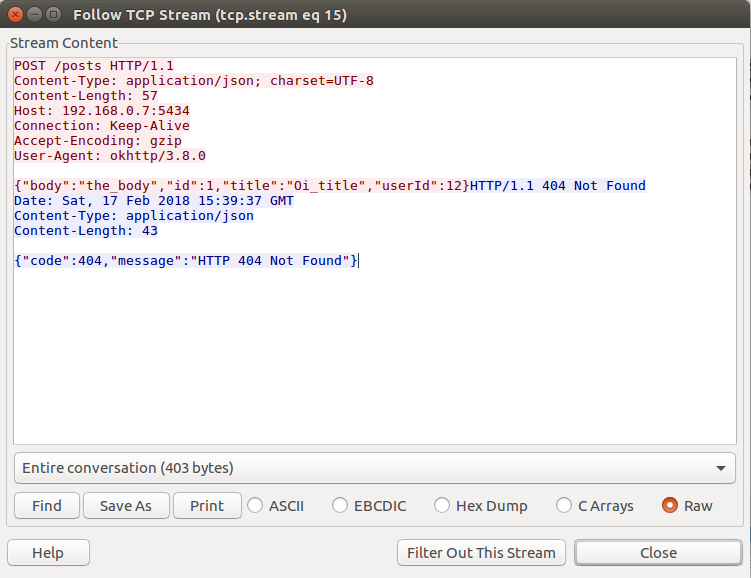

# The second application example using retrofit2, rxjava2

## Where is it from
Taken from the tutorial: https://code.tutsplus.com/tutorials/sending-data-with-retrofit-2-http-client-for-android--cms-27845

## What I changed (only a bit)
- update the library version
- change from rxjava to rxjava2
- separate the code and function for posting the json and formurlencoded to see the examples easier

## Notes that I took (for myself)
- To convert Json schema to POJO, use this as a reference: http://www.jsonschema2pojo.org/ 
- In AndroidManifest.xml, add this:
```xml
<uses-permission android:name="android.permission.INTERNET" />
```
- When testing this on the Android, make sure there is a server listening to the specified port (see build.gradle for the server URL). For this testing purpose, set any server (nginx/apache/anything) to listen to that port is fine (but will return 404 not found).

How the example app looks like:



Results taken from Wireshark:

POST form-urlencoded:



POST json:

